# CipherQuest Architecture Documentation

## 🏗️ System Architecture

### High-Level Architecture

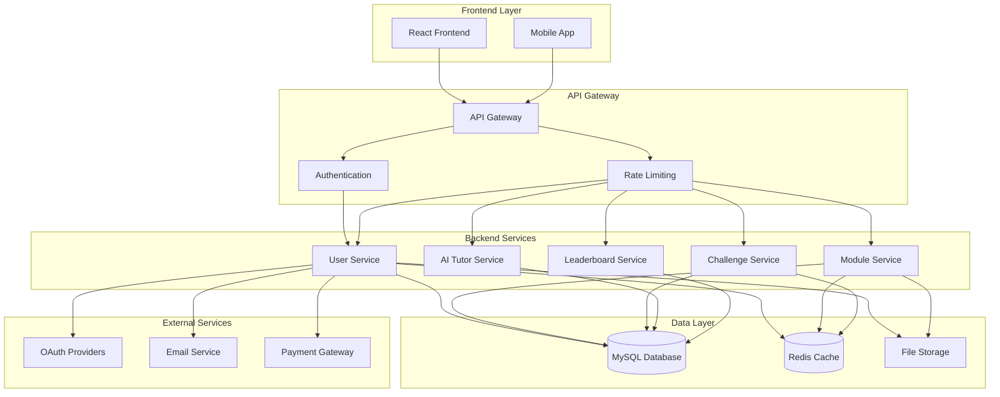

### Technology Stack

#### Frontend
- **Framework**: React 18 with TypeScript
- **State Management**: Redux Toolkit
- **Styling**: CSS Modules + Tailwind CSS
- **Build Tool**: Vite
- **Testing**: Jest + React Testing Library

#### Backend
- **Framework**: Flask (Python)
- **Database ORM**: SQLAlchemy
- **Authentication**: JWT + OAuth2
- **API Documentation**: OpenAPI 3.0
- **Testing**: Pytest

#### Database
- **Primary**: MySQL 8.0
- **Cache**: Redis
- **File Storage**: AWS S3 / Local Storage

#### Infrastructure
- **Containerization**: Docker + Docker Compose
- **CI/CD**: GitHub Actions
- **Deployment**: Heroku, Vercel, Docker Hub
- **Monitoring**: Sentry, LogRocket

## 🔄 Data Flow Diagrams

### User Authentication Flow

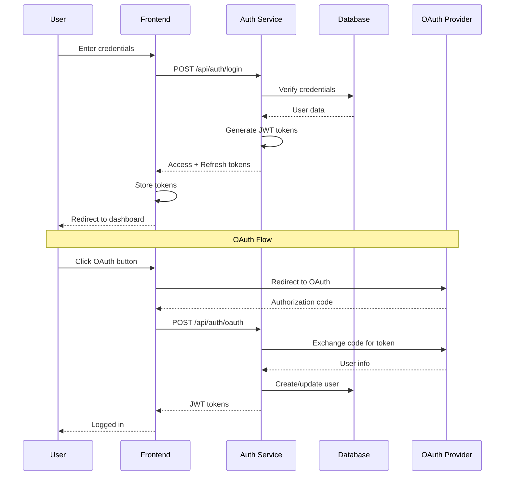

### Module Learning Flow

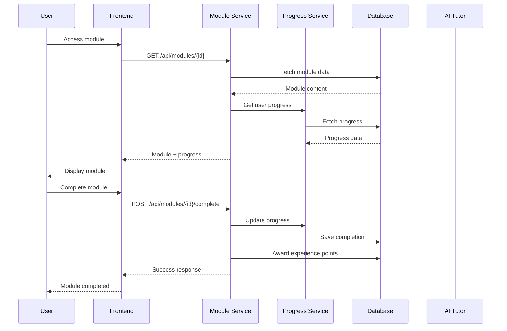

### Challenge Submission Flow

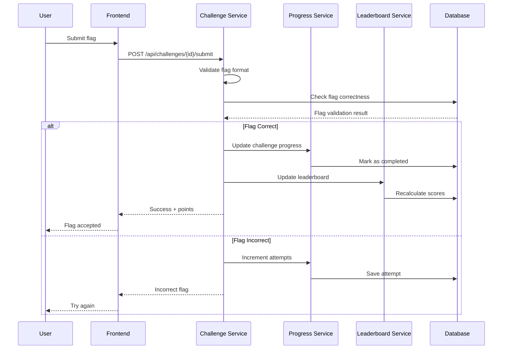

### AI Tutor Interaction Flow

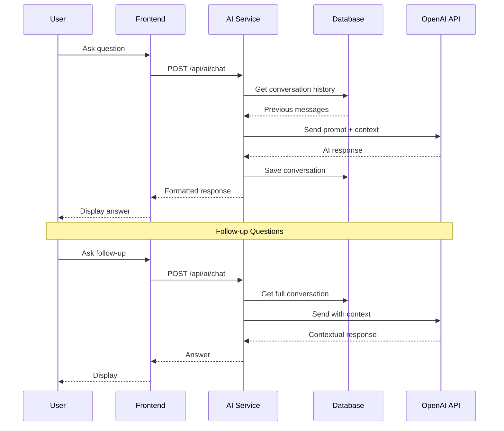

## 🗄️ Database Schema

### Core Tables

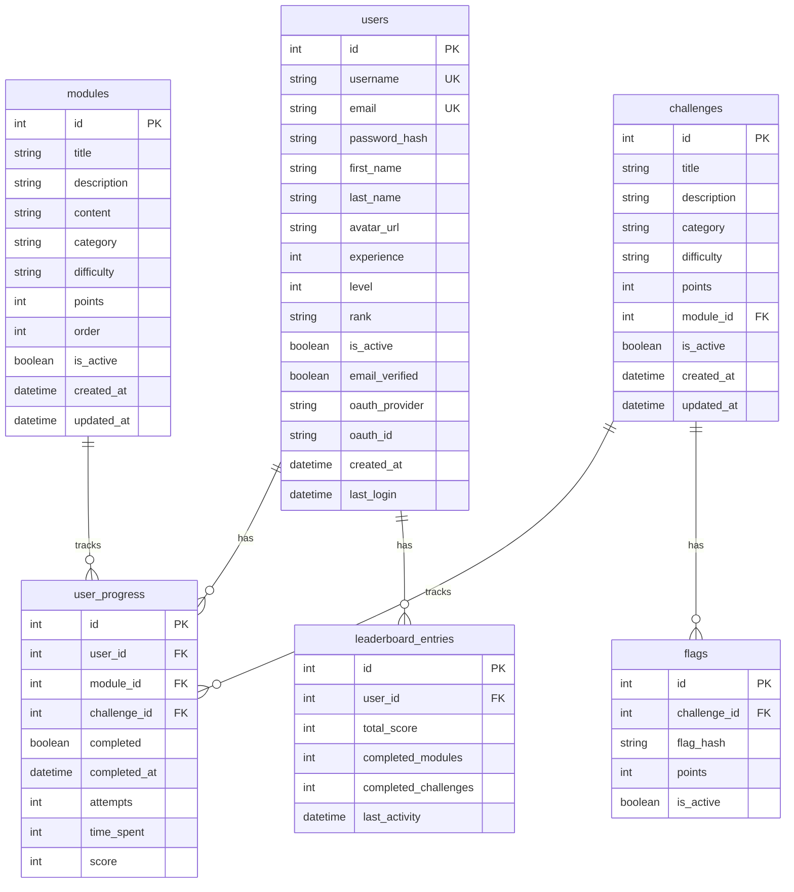

## 🔐 Security Architecture

### Authentication & Authorization

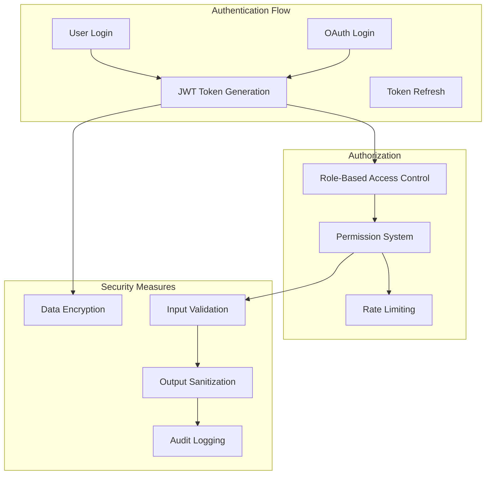

### Data Protection

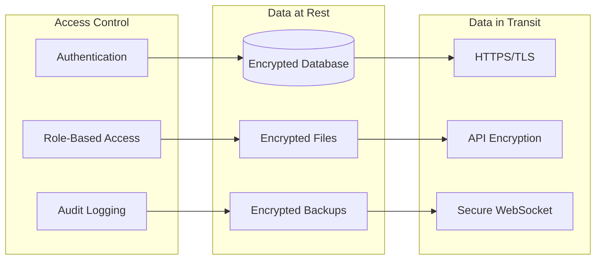

## 🚀 Deployment Architecture

### Production Environment

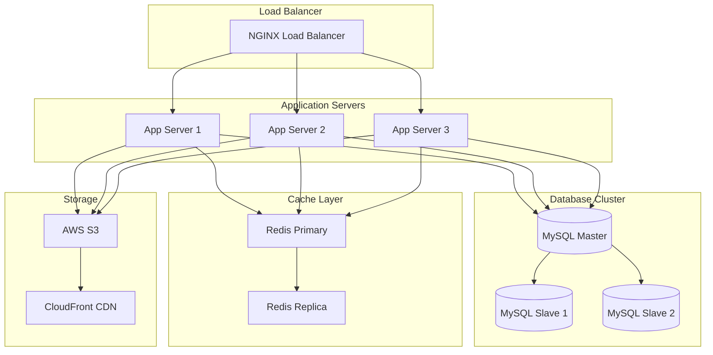

### CI/CD Pipeline

```mermaid
graph LR
    subgraph "Development"
        Code[Code Changes]
        Tests[Unit Tests]
        Coverage[Code Coverage]
    end
    
    subgraph "CI/CD"
        Build[Docker Build]
        Security[Security Scan]
        Deploy[Deploy to Staging]
    end
    
    subgraph "Testing"
        Integration[Integration Tests]
        E2E[End-to-End Tests]
        Performance[Performance Tests]
    end
    
    subgraph "Production"
        Staging[Staging Environment]
        Production[Production Deployment]
        Monitoring[Monitoring & Alerts]
    end
    
    Code --> Tests
    Tests --> Coverage
    Coverage --> Build
    Build --> Security
    Security --> Deploy
    Deploy --> Integration
    Integration --> E2E
    E2E --> Performance
    Performance --> Staging
    Staging --> Production
    Production --> Monitoring
```

## 📊 Monitoring & Analytics

### System Monitoring

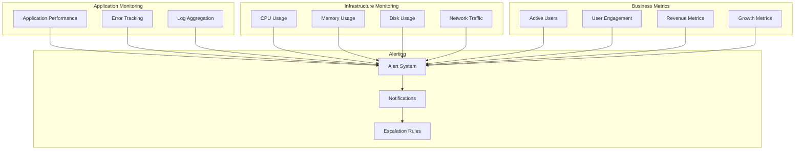

## 🔄 API Architecture

### RESTful API Design

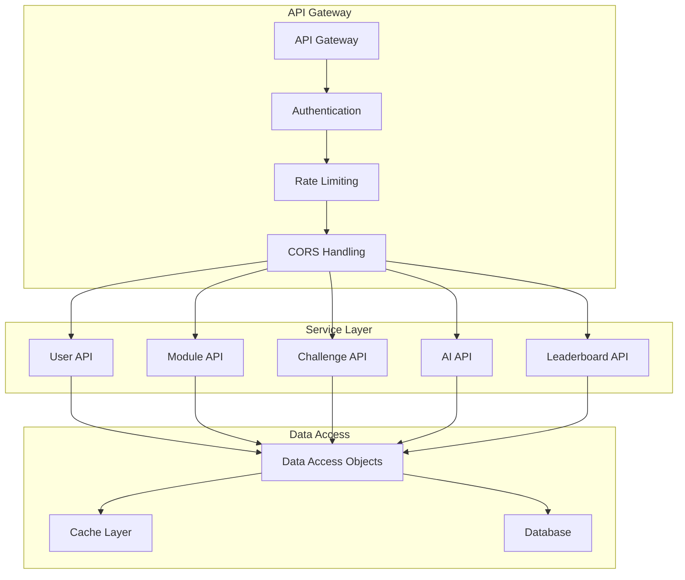

## 🎯 Performance Optimization

### Caching Strategy

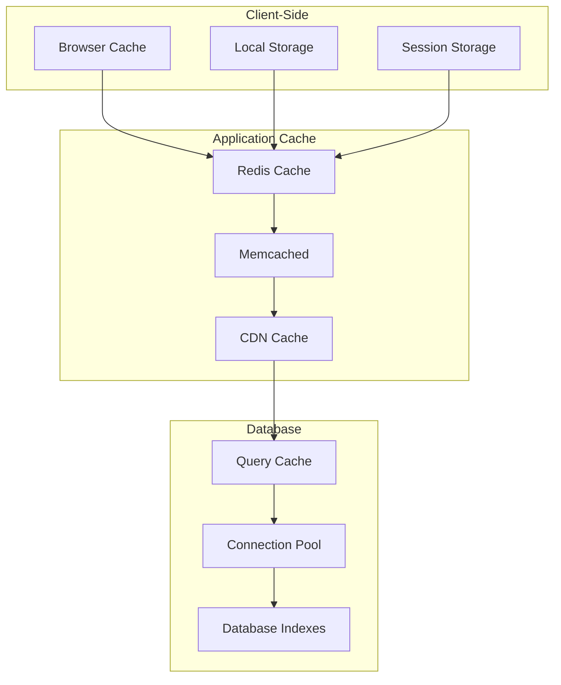

---

This architecture documentation provides a comprehensive overview of the CipherQuest platform's technical design, data flows, and system components. For detailed implementation guides, refer to the specific service documentation. 