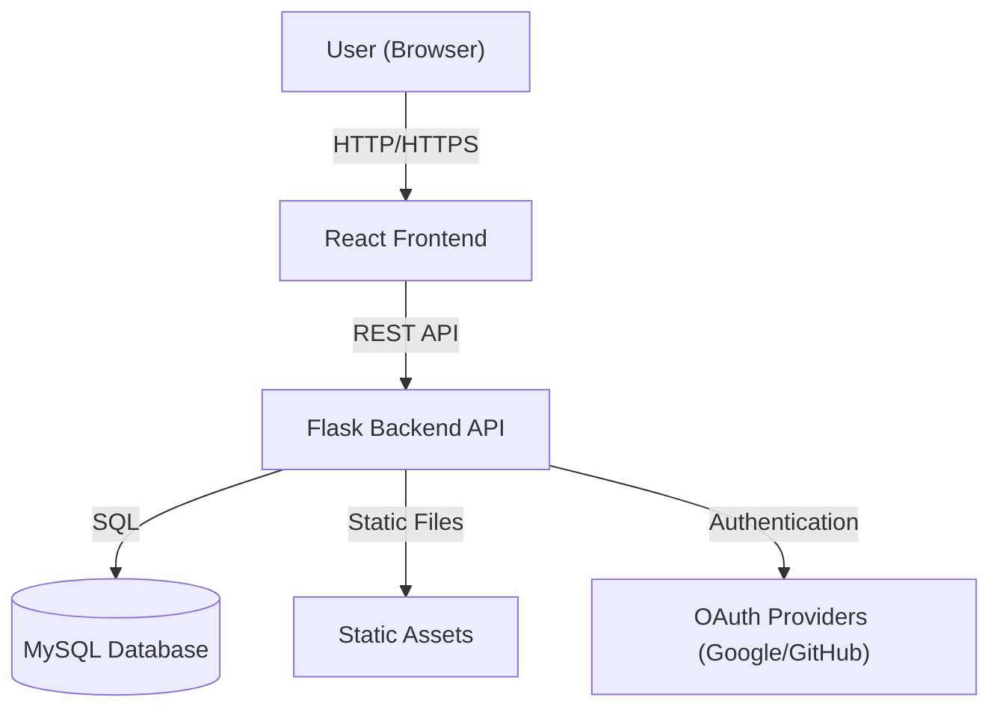

# CipherQuest Architecture

## Components
- **Frontend**: React app for user interface, authentication, and challenge interaction.
- **Backend**: Flask API for authentication, modules, challenges, progress, and admin features.
- **Database**: MySQL for persistent storage of users, modules, challenges, progress, and leaderboard.
- **Static Assets**: Served by Flask for any required static files.
- **OAuth Providers**: Used for third-party authentication (Google, GitHub). 